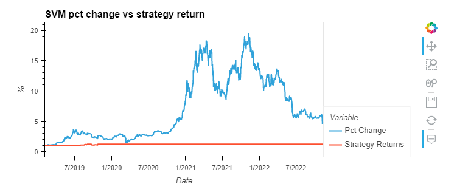

# BTC Price Predictor

[Planning doc](https://github.com/stipptracie/BTC_Price_Predictor/blob/main/ProjectOutline.md)

[Google Slides Presentation](https://docs.google.com/presentation/d/1HGoxUIvRFVSQXJkmUEHEMvzjjBAcIP2ZBC31PUGa6yc/edit#slide=id.p)

The goal of this notebook is to better predict Bitcoin prices using technical indicators, sentiment analysis and machine learning.


---

## Required Installs

### Language: Python 3.7.13

### Libraries used:

[Pandas](https://pandas.pydata.org/pandas-docs/stable/index.html) - For the creation and manipulation of Data Frames

[Jupyter Labs](https://jupyter.org/) - An ipython kernel for interactive computing in python

[Numpy](https://numpy.org/) - NumPy is an open source project aiming to enable numerical computing with Python.

[Talib](https://ta-lib.org/) - TA-Lib is widely used by trading software developers requiring to perform technical analysis of financial market data.

[Pandas_datareader](https://pypi.org/project/pandas-datareader/) - Pandas Datareader is a Python package that allows us to create a pandas DataFrame object by using various data sources from the internet. It is popularly used for working with realtime stock price datasets.

[Sklearn](https://scikit-learn.org/stable/index.html) - Scikit-learn: Machine Learning library, Simple and efficient tools for predictive data analysis

[Pycaret](https://pycaret.org/) - PyCaret is an open-source, machine learning library in Python that automates machine learning workflows.

[Matplotlib](https://matplotlib.org/) - Matplotlib is a comprehensive library for creating static, animated, and interactive visualizations in Python. 

[Hvplot](https://hvplot.holoviz.org/) - HvPlot provides a high-level plotting API built on HoloViews that provides a general and consistent API for plotting data.

[XGBoost](https://xgboost.readthedocs.io/en/stable/install.html) - XGBoost provides binary packages for some language bindings. The binary packages support the GPU algorithm (gpu_hist) on machines with NVIDIA GPUs.

---

## Install
```
# create a conda environment
conda create --name yourenvname python=3.8

# activate conda environment
conda activate yourenvname

# install pycaret
pip install pycaret

```
If that doesn't work try:
```
# install the full version of pycaret
pip install pycaret[full]
```

---

## Data
- BTC price data pulled from Yahoo Finance. 
- Technical indicators created using Talib. 
- BTC sentiment indicator pulled from alternative.me using the following:

```
r = requests.get('https://api.alternative.me/fng/?limit=0')
r.json()
df = pd.DataFrame(r.json()['data'])
```
The sentiment indicator we are using measures "fear and greed".  The sourcs it uses include: social media, dominance, trends, volatility and market momentum.

[Crypto Fear & Greed Index](https://alternative.me/crypto/fear-and-greed-index/)


### Inital Model
Our inital model was based on using SVM but using our sentiment indicator would cause the model to break.  We found a similar issue using linear regression.

Here is the data we used for our mode:

A sample of our models code:


Our first model won't work with the sentiment indicator:



Moving our model to GXBoost solved the issue:


---
## Pycaret
Knowing we have issues using some of our features we need to be able to test multiple models. Pycaret will allow us to test and analyze multiple models and allow us to choose the best fit.
[Pycaret](https://pycaret.org/)


---
## Conclusion
Here is the describe data from our different models.  Our two inital models can be found under Pycaret_inital.  We tested with all of our features and then just using one feature.

From there we tested different models and attempted to optimize our features using the graphs found in Pycaret.  Those models can be found under Pycaret_test.

Our final model can be found under Pycaret_final. We also tested our predictor by moving the prediction date from next day to 7 and 14 days. 


---
## Contributors

Created by Ryan Granston, Austin Means and Tracie Stipp while in the UW FinTech Bootcamp
> Contact Info:
>
> email: austinmeans92@gmail.com|
> [GitHub](https://github.com/aimeans) |
>
> email: ryan.granston@gmail.com |
> [GitHub](https://github.com/RGranston) |
>
> email: stipptracie@gmail.com |
> [GitHub](https://github.com/stipptracie) |
> [LinkedIn](https://www.linkedin.com/in/tracie-stipp-0719691b/)
>

---

